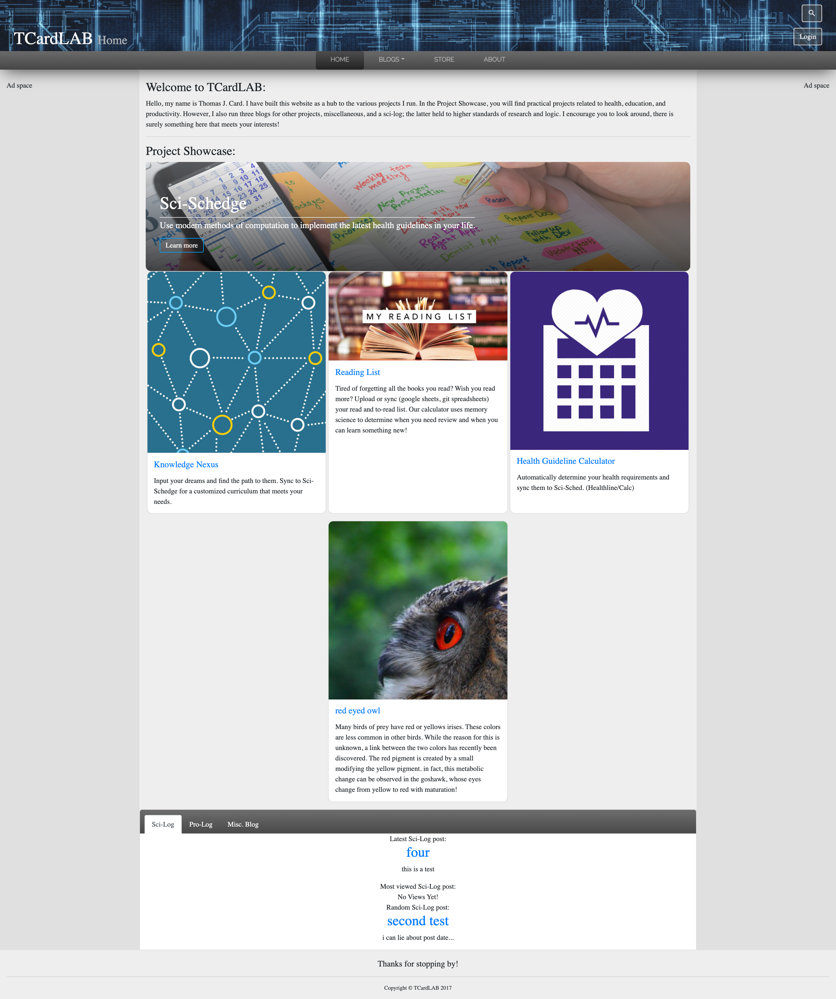

# wagtail-site
My first website built with django-wagtail and vue! (2018)

## How to run:
    # Env Windows (or use conda)
    $ python3 -m venv mysite\env
    $ mysite\env\Scripts\activate.bat
    
    # Env Mac/Unix (or use conda)
    $ python3 -m venv mysite/env
    $ source mysite/env/bin/activate
    
    # Install
    $ cd { path to repo }
    $ pip install -r requirements.txt
    
    # Initialize site
    $ python manage.py migrate
    $ python manage.py createsuperuser
    
    # Run
    $ python manage.py runserver

## Preview
I have never published this site and cannot guarantee an easy start up.
So, I have provided some screen shots.
### Home Page

<!---->

### About Page

### Blog Index Page 

